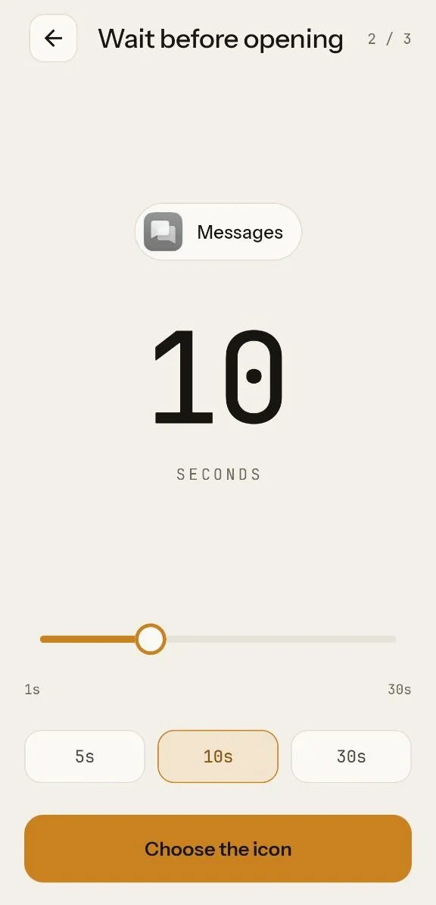

# SlowLock

**A few seconds between the impulse and the app.**

[Website](https://tberchanov.github.io/SlowLock/) · [Google Play](https://play.google.com/store/apps/details?id=com.slowlock) · [Privacy Policy](https://tberchanov.github.io/SlowLock/privacy.html)

---

## What it does

You reach for the feed without deciding to. SlowLock puts a lock-alike icon of that app
on your home screen — same icon, same label — and tapping it shows a full-screen wait
before the real app opens. That pause is the whole product: enough time to notice the
reach and back out.

It is **a nudge, not a blocker.** You can press back or home at any moment during the
wait, and the app's original icon still works. Bypassability is the design, not a defect —
SlowLock treats you as a willing participant, not as an adversary to be policed.

## How it works

1. **Pick an app** from the list of launchable apps on the device.
2. **Choose a wait** — 1 to 30 seconds — and an icon treatment: `Original`, `Invert`
   (photographic negative), or `Gray`.
3. **Pin the shortcut.** Android's own pin dialog puts it on the home screen with the
   target's icon and current label.
4. **Tap it.** A full-screen wait runs, then the target app launches.

The **Locks** screen lists everything you've pinned and lets you retune or remove it.
An app that has been uninstalled still shows as a row, because its icon may still be
sitting on your home screen.

## License

[MIT](LICENSE)
